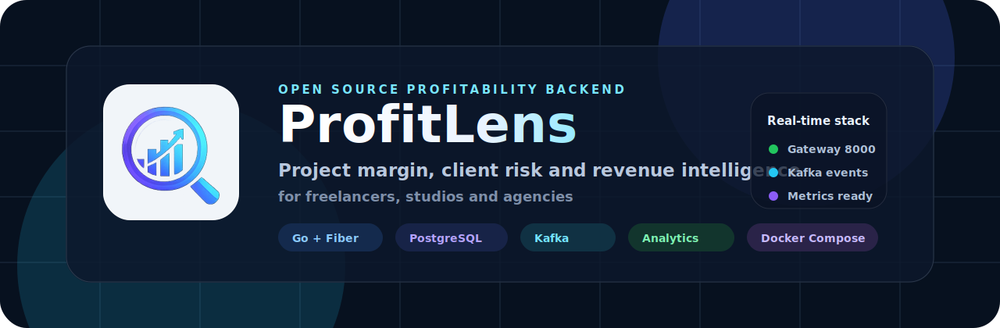

<p align="center">
  
</p>

<h1 align="center">ProfitLens</h1>

<p align="center">
  Freelancer'lar ve ajanslar için proje bazlı gerçek kârlılık, müşteri riski, fatura tahsilatı ve operasyonel performans takibi sağlayan mikroservis tabanlı SaaS backend platformu.
</p>

<p align="center">
  <a href="http://localhost:8000/docs"><strong>API Portal</strong></a>
  ·
  <a href="#hızlı-başlangıç"><strong>Hızlı Başlangıç</strong></a>
  ·
  <a href="#api-test-akışı"><strong>API Test Akışı</strong></a>
  ·
  <a href="#katkı-rehberi"><strong>Katkı Rehberi</strong></a>
</p>

<p align="center">
  
  
  
  
  
  
</p>

<p align="center">
  
</p>

## İçindekiler

- [ProfitLens Nedir?](#profitlens-nedir)
- [Öne Çıkan Özellikler](#öne-çıkan-özellikler)
- [Teknoloji Yığını](#teknoloji-yığını)
- [Mimari](#mimari)
- [Servisler ve Portlar](#servisler-ve-portlar)
- [Hızlı Başlangıç](#hızlı-başlangıç)
- [API Test Akışı](#api-test-akışı)
- [Kârlılık Hesaplama](#kârlılık-hesaplama)
- [Müşteri Risk Skoru](#müşteri-risk-skoru)
- [Kafka Eventleri](#kafka-eventleri)
- [Redis Cache Stratejisi](#redis-cache-stratejisi)
- [Veritabanı ve Migration](#veritabanı-ve-migration)
- [Gözlemlenebilirlik](#gözlemlenebilirlik)
- [Güvenlik Modeli](#güvenlik-modeli)
- [Geliştirme Komutları](#geliştirme-komutları)
- [Sorun Giderme](#sorun-giderme)
- [Katkı Rehberi](#katkı-rehberi)

## ProfitLens Nedir?

ProfitLens, freelance çalışanların ve ajansların "ciro var ama kâr nerede?" sorusuna teknik olarak ölçülebilir yanıt vermek için tasarlanmış bir SaaS backend projesidir.

Platform; müşteri, proje, zaman kaydı, gider, fatura ve tahsilat verilerini bir araya getirerek proje bazlı gerçek net kârı, kâr marjını ve müşteri riskini hesaplar. Mikroservis mimarisi sayesinde her alan kendi servisinde izole edilir; servisler arası iş olayları Kafka üzerinden akar.

SEO anahtar kelimeleri: `freelancer profitability software`, `agency project profitability`, `Go microservices SaaS`, `Kafka event driven backend`, `PostgreSQL Redis analytics API`, `project profit margin tracking`.

## Öne Çıkan Özellikler

- Proje bazlı gelir, gider, saat maliyeti, net kâr ve marj hesaplama
- Müşteri bazlı risk skoru üretimi
- JWT access token ve refresh token tabanlı authentication
- API Gateway üzerinden tek public giriş noktası
- Kafka ile event-driven analytics güncelleme
- Redis ile read-through cache stratejisi
- PostgreSQL 16 üzerinde ham SQL ve `pgx/v5`
- Prometheus metrikleri ve Grafana dashboardları
- Docker Compose ile tek komutla lokal kurulum
- Swagger tarzı modern API Portal ve canlı test arayüzü
- Her serviste bağımsız build, migration ve graceful shutdown

## Teknoloji Yığını

| Katman | Teknoloji |
|---|---|
| Dil | Go 1.22 |
| HTTP Framework | Fiber v2 |
| Veritabanı | PostgreSQL 16 |
| SQL Driver | pgx/v5, ham SQL |
| Cache | Redis 7 |
| Event Bus | Kafka + Zookeeper |
| Auth | JWT access token + refresh token |
| Metrics | Prometheus |
| Dashboard | Grafana |
| Container | Docker + Docker Compose |
| Logging | zap structured JSON logger |
| Migration | golang-migrate |

## Mimari

ProfitLens mikroservis mimarisiyle tasarlanmıştır. Dış dünya yalnızca `gateway` servisine erişir. Domain servisleri kendi sorumluluk alanlarını yönetir ve birbirleriyle doğrudan HTTP çağrısı yapmaz.

```text
Client / API Portal
       |
       v
API Gateway :8000
       |
       +--> Auth Service      :8001
       +--> Project Service   :8002
       +--> Billing Service   :8003
       +--> Analytics Service :8004

PostgreSQL 16  <-->  Servis verileri ve refresh tokenlar
Redis 7        <-->  Cache ve rate limiting
Kafka          <-->  Async profitability ve risk eventleri
Prometheus     <-->  /metrics scraping
Grafana        <-->  Monitoring dashboard
```

## Servisler ve Portlar

| Servis | Port | Sorumluluk |
|---|---:|---|
| `gateway` | `8000` | Public API Gateway, docs, proxy, auth validation, rate limit |
| `auth-service` | `8001` | Register, login, refresh, logout |
| `project-service` | `8002` | Clients, projects, time entries, expenses |
| `billing-service` | `8003` | Invoices, sent/paid status, overdue invoices |
| `analytics-service` | `8004` | Profitability, risk score, dashboard, reports |
| `postgres` | `55432` | Local PostgreSQL host port |
| `pgadmin` | `5050` | Database UI |
| `grafana` | `3000` | Dashboard UI |
| `prometheus` | `9090` | Metrics UI |
| `kafka` | `9092` | Local Kafka broker |

## Hızlı Başlangıç

### Gereksinimler

- Docker Desktop
- Docker Compose v2
- PowerShell, Bash veya benzeri terminal
- Boş veya uygun portlar: `3000`, `5050`, `8000-8004`, `9090`, `9092`, `2181`, `55432`

### Projeyi Çalıştır

Lokal ayarlari hazirla:

```bash
cp .env.example .env
```

`.env.example` yalnizca lokal gelistirme icin ornek degerler icerir. Production ortaminda `JWT_SECRET`, veritabani parolasi ve admin parolalari secret manager veya deployment ortamindan verilmelidir.

```bash
docker compose up -d --build
```

Servis durumlarını kontrol et:

```bash
docker compose ps
```

Logları izle:

```bash
docker compose logs -f gateway
```

### Önemli URL'ler

| Araç | URL | Giriş Bilgisi |
|---|---|---|
| API Portal | `http://localhost:8000/docs` | Public |
| Gateway Metrics | `http://localhost:8000/metrics` | Public |
| Grafana | `http://localhost:3000` | `.env` icindeki `GRAFANA_ADMIN_USER` / `GRAFANA_ADMIN_PASSWORD` |
| Prometheus | `http://localhost:9090` | Public |
| pgAdmin | `http://localhost:5050` | `.env` icindeki `PGADMIN_DEFAULT_EMAIL` / `PGADMIN_DEFAULT_PASSWORD` |

pgAdmin içinde PostgreSQL server eklemek için:

```text
Host: postgres
Port: 5432
Username: profitlens
Password: .env icindeki POSTGRES_PASSWORD
Database: profitlens
```

Host makineden bağlanırken:

```text
Host: localhost
Port: 55432
Username: profitlens
Password: .env icindeki POSTGRES_PASSWORD
Database: profitlens
```

## API Test Akışı

API Portal içinde canlı test alanı vardır:

```text
http://localhost:8000/docs
```

Terminal üzerinden manuel test için aşağıdaki akışı kullanabilirsin.

### 1. Kullanıcı Oluştur

```bash
curl -X POST http://localhost:8000/auth/register \
  -H "Content-Type: application/json" \
  -d '{
    "email": "demo@profitlens.com",
    "password": "Password123!",
    "full_name": "Demo User",
    "hourly_cost": "250.00"
  }'
```

### 2. Login Ol ve Token Al

```bash
curl -X POST http://localhost:8000/auth/login \
  -H "Content-Type: application/json" \
  -d '{
    "email": "demo@profitlens.com",
    "password": "Password123!"
  }'
```

Yanıttaki `data.access_token` değerini korumalı endpointlerde kullan:

```bash
curl http://localhost:8000/dashboard \
  -H "Authorization: Bearer ${ACCESS_TOKEN}"
```

### 3. Client Oluştur

```bash
curl -X POST http://localhost:8000/clients \
  -H "Authorization: Bearer ${ACCESS_TOKEN}" \
  -H "Content-Type: application/json" \
  -d '{
    "name": "Acme Studio",
    "country": "TR",
    "currency": "TRY"
  }'
```

### 4. Project Oluştur

```bash
curl -X POST http://localhost:8000/projects \
  -H "Authorization: Bearer ${ACCESS_TOKEN}" \
  -H "Content-Type: application/json" \
  -d '{
    "client_id": "${CLIENT_ID}",
    "name": "E-Commerce Redesign",
    "type": "fixed",
    "budget_cents": 500000,
    "currency": "TRY"
  }'
```

### 5. Time Entry ve Expense Ekle

```bash
curl -X POST http://localhost:8000/projects/${PROJECT_ID}/time-entries \
  -H "Authorization: Bearer ${ACCESS_TOKEN}" \
  -H "Content-Type: application/json" \
  -d '{
    "hours": "4.00",
    "hourly_rate_cents": 150000,
    "description": "Development work",
    "entry_date": "2026-04-29"
  }'
```

```bash
curl -X POST http://localhost:8000/projects/${PROJECT_ID}/expenses \
  -H "Authorization: Bearer ${ACCESS_TOKEN}" \
  -H "Content-Type: application/json" \
  -d '{
    "category": "tool",
    "amount_cents": 50000,
    "currency": "TRY",
    "description": "Design tool",
    "expense_date": "2026-04-29"
  }'
```

### 6. Invoice Oluştur ve Ödendi İşaretle

```bash
curl -X POST http://localhost:8000/invoices \
  -H "Authorization: Bearer ${ACCESS_TOKEN}" \
  -H "Content-Type: application/json" \
  -d '{
    "project_id": "${PROJECT_ID}",
    "amount_cents": 500000,
    "currency": "TRY",
    "issued_date": "2026-04-29",
    "due_date": "2026-05-29"
  }'
```

```bash
curl -X PATCH http://localhost:8000/invoices/${INVOICE_ID}/pay \
  -H "Authorization: Bearer ${ACCESS_TOKEN}"
```

### 7. Kârlılığı Oku

```bash
curl http://localhost:8000/projects/${PROJECT_ID}/profitability \
  -H "Authorization: Bearer ${ACCESS_TOKEN}"
```

## Kârlılık Hesaplama

ProfitLens para değerlerini her zaman integer cent/kuruş olarak saklar. Float para hesabı yapılmaz.

```text
Gelir         = Ödenmiş fatura toplamı
Saat Maliyeti = Toplam saat × kullanıcının hourly_cost değeri
Toplam Gider  = Projeye eklenen giderlerin toplamı
Net Kâr       = Gelir - Saat Maliyeti - Toplam Gider
Kâr Marjı     = (Net Kâr / Gelir) × 100
```

Örnek:

```text
Gelir:          500000 kuruş
Saat maliyeti:  100000 kuruş
Gider:           50000 kuruş
Net kâr:        350000 kuruş
Marj:            70.00%
```

## Müşteri Risk Skoru

Risk skoru `0` ile `100` arasında hesaplanır.

| Aralık | Anlam |
|---:|---|
| `0-30` | Sağlıklı müşteri |
| `31-60` | Dikkat gerektiren müşteri |
| `61-100` | Zararlı veya yüksek riskli müşteri |

Skor bileşenleri:

| Faktör | Ağırlık |
|---|---:|
| Gecikmiş fatura sayısı | `%30` |
| Ortalama ödeme gecikmesi | `%25` |
| Revizyon/şikayet oranı | `%20` |
| Proje kâr marjı | `%15` |
| Toplam iş hacmi | `%10` |

## Kafka Eventleri

Eventler ortak wrapper formatıyla yayınlanır:

```json
{
  "event_type": "time.entry.created",
  "payload": {},
  "occurred_at": "2026-04-29T10:30:00Z"
}
```

| Event | Publisher | Consumer | Etki |
|---|---|---|---|
| `time.entry.created` | project-service | analytics-service | Kârlılık yeniden hesaplanır |
| `expense.added` | project-service | analytics-service | Kârlılık yeniden hesaplanır |
| `invoice.paid` | billing-service | analytics-service | Kâr ve risk güncellenir |
| `invoice.overdue` | billing-service | analytics-service | Risk skoru artırılır |
| `project.closed` | project-service | analytics-service | Final snapshot oluşturulur |

## Redis Cache Stratejisi

Okuma modeli read-through cache mantığıyla çalışır:

1. Redis key kontrol edilir.
2. Cache hit varsa veri doğrudan döner.
3. Cache miss varsa veri hesaplanır.
4. Hesaplanan sonuç Redis'e yazılır.
5. API response döner.

| Key | Açıklama | TTL |
|---|---|---:|
| `profit:project:{project_id}` | Proje kârlılık özeti | 5 dk |
| `profit:client:{client_id}` | Müşteri toplamı | 5 dk |
| `risk:client:{client_id}` | Müşteri risk skoru | 1 saat |
| `dashboard:user:{user_id}` | Kullanıcı dashboard özeti | 5 dk |

## Veritabanı ve Migration

Migration sırası Docker Compose içinde kontrollüdür:

1. `migrate-auth`
2. `migrate-project`
3. `migrate-billing`
4. `migrate-analytics`

Her migration runner ayrı migration table kullanır:

```text
auth_schema_migrations
project_schema_migrations
billing_schema_migrations
analytics_schema_migrations
```

Temel tablolar:

- `users`
- `refresh_tokens`
- `clients`
- `projects`
- `time_entries`
- `expenses`
- `invoices`
- `profit_snapshots`

Tüm ana tablolarda soft delete ve zaman alanları bulunur:

```sql
id UUID PRIMARY KEY DEFAULT gen_random_uuid()
created_at TIMESTAMPTZ DEFAULT now()
updated_at TIMESTAMPTZ DEFAULT now()
deleted_at TIMESTAMPTZ
```

## Gözlemlenebilirlik

Her servis `/metrics` endpointi açar.

| Metrik | Açıklama |
|---|---|
| `http_requests_total` | Method, path ve status bazlı HTTP sayacı |
| `http_request_duration_seconds` | HTTP latency histogramı |
| `kafka_events_published_total` | Yayınlanan Kafka event sayacı |
| `kafka_events_consumed_total` | Tüketilen Kafka event sayacı |

Monitoring araçları:

```text
Prometheus: http://localhost:9090
Grafana:    http://localhost:3000
```

Grafana giriş bilgileri:

```text
Username: .env icindeki GRAFANA_ADMIN_USER
Password: .env icindeki GRAFANA_ADMIN_PASSWORD
```

## Güvenlik Modeli

- Password hash: bcrypt cost `12`
- Access token TTL: `15 dakika`
- Refresh token TTL: `7 gün`
- Refresh token veritabanında saklanır
- Logout refresh token kaydını siler
- `/auth/*` dışındaki endpointler JWT ister
- Kullanıcı yalnızca kendi verisine erişebilir
- Rate limiting Redis üzerinden yapılır
- JWT secret `.env` dosyalarından gelir
- Secret değerleri repository içine gömülmez

Koruma beklenen örnek hata:

```json
{
  "success": false,
  "error": {
    "code": "UNAUTHORIZED",
    "message": "Invalid or missing access token"
  }
}
```

## Geliştirme Komutları

Tüm stack:

```bash
docker compose up -d --build
```

Stack durdurma:

```bash
docker compose down
```

Log izleme:

```bash
docker compose logs -f gateway
docker compose logs -f auth-service
docker compose logs -f project-service
docker compose logs -f billing-service
docker compose logs -f analytics-service
```

Gateway test:

```bash
cd gateway
go test ./...
```

CI ile ayni Go test/build matrisini lokal calistirmak icin her modulde `go test ./...` ve `go build ./cmd` komutlari kullanilir. GitHub Actions workflow'u gateway, auth, project, billing ve analytics modullerini ayri ayri test eder; ayrica `docker compose config --quiet` ile Compose dosyasini dogrular.

Servis build:

```bash
docker compose build gateway
docker compose build auth-service
docker compose build project-service
docker compose build billing-service
docker compose build analytics-service
```

## Ortam Değişkenleri

Her servis kendi `.env.example` dosyasına sahiptir.

Öne çıkan değişkenler:

| Değişken | Açıklama |
|---|---|
| `PORT` | Servis portu |
| `SERVICE_NAME` | Log ve metrics service label |
| `DATABASE_URL` | PostgreSQL connection string |
| `REDIS_ADDR` | Redis host/port |
| `KAFKA_BROKERS` | Kafka broker listesi |
| `JWT_SECRET` | JWT imzalama secret değeri |
| `AUTH_SERVICE_URL` | Gateway auth upstream |
| `PROJECT_SERVICE_URL` | Gateway project upstream |
| `BILLING_SERVICE_URL` | Gateway billing upstream |
| `ANALYTICS_SERVICE_URL` | Gateway analytics upstream |

## Response Formatı

Başarılı response:

```json
{
  "success": true,
  "data": {}
}
```

Hata response:

```json
{
  "success": false,
  "error": {
    "code": "INVOICE_NOT_FOUND",
    "message": "Invoice not found"
  }
}
```

## Sorun Giderme

### Kafka `NodeExists` Hatası

Kafka restart sırasında Zookeeper içinde eski broker kaydı kalırsa Kafka çıkabilir. Çoğu durumda tekrar başlatmak yeterlidir:

```bash
docker compose up -d
```

Gerekirse Zookeeper broker node temizlenebilir:

```bash
docker exec profitlens-zookeeper zookeeper-shell localhost:2181 delete /brokers/ids/1
docker compose up -d kafka
```

### pgAdmin CSRF Hatası

Compose içinde pgAdmin CSRF koruması lokal geliştirme için kapatılmıştır:

```yaml
PGADMIN_CONFIG_WTF_CSRF_ENABLED: "False"
```

Tarayıcı cache/cookie temizliği gerekebilir.

### `UNAUTHORIZED` Hatası

`/auth/register`, `/auth/login`, `/auth/refresh`, `/auth/logout` dışındaki endpointler token ister.

```http
Authorization: Bearer <access_token>
```

### Port Çakışması

Meşgul portları kontrol et:

```bash
docker compose ps
```

Gerekirse ilgili portu kullanan uygulamayı kapat veya `docker-compose.yml` içindeki host port mapping değerini değiştir.

## Proje Yapısı

```text
profitlens/
├── gateway/
│   ├── cmd/
│   ├── docs/
│   ├── Dockerfile
│   └── .env.example
├── services/
│   ├── auth-service/
│   ├── project-service/
│   ├── billing-service/
│   └── analytics-service/
├── monitoring/
│   ├── prometheus.yml
│   └── grafana/
├── assets/
├── docker-compose.yml
└── README.md
```

## Yol Haritası

- API contract testleri
- End-to-end test suite
- Role based access control
- Multi-currency conversion service
- Client complaint/revision tracking
- Kafka retry ve dead letter topic stratejisi
- Production deployment manifests
- Public SDK örnekleri

## Katkı Rehberi

Katkılar memnuniyetle karşılanır. Değişiklik yaparken şu kurallara dikkat et:

- Kod, değişken adları, loglar, hata mesajları ve API response metinleri İngilizce olmalıdır.
- README ve mimari dokümanlar Türkçe yazılır.
- ORM kullanılmaz; PostgreSQL erişimi ham SQL ve `pgx/v5` ile yapılır.
- Para değerleri integer cent/kuruş olarak saklanır.
- Her query context ile çalışmalı ve timeout davranışına uymalıdır.
- Kullanıcı verilerinde mutlaka `user_id` izolasyonu korunmalıdır.
- Yeni endpointler OpenAPI dokümanına eklenmelidir.
- Yeni servis davranışları `/metrics` ve structured log yaklaşımını korumalıdır.

Önerilen katkı akışı:

1. Issue veya geliştirme başlığını netleştir.
2. Küçük ve izole branch aç.
3. İlgili servis için test veya smoke akışı ekle.
4. README veya API docs gerekiyorsa güncelle.
5. Pull request açıklamasında davranış değişikliğini, migration etkisini ve test çıktısını belirt.

## Lisans

Bu repository açık kaynak kullanıma hazırlanmış bir SaaS backend iskeletidir. Lisans dosyası eklendiğinde burada güncellenecektir.

---

<p align="center">
  <strong>ProfitLens</strong> ile proje kârlılığını, müşteri riskini ve tahsilat performansını tek API yüzeyinden görünür hale getirin.
</p>
